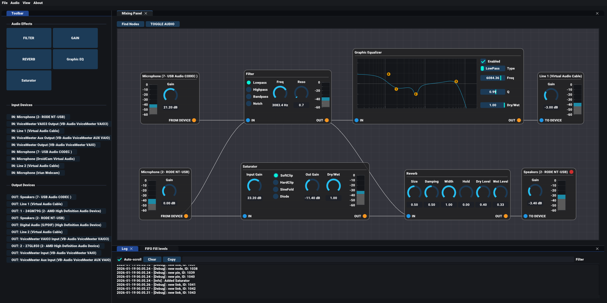

# routeCarrier: A Modular Hardware Audio Router for Windows (WIP)

This is a work-in-progress modular audio routing tool.
This program is built around a node editor where audio devices can be connected by a graph structure.

## Who is it for?

- DJs, streamers, audio engineers
- Power users experimenting with audio pipelines
- People interested in PC routing media (VoiceMeeter, Discord, OBS, Voicemod, DAWs ,Virtual Audio Cable, etc.)

## Platform

- Runs on Windows
- Based on DirectX11 / Win32 implementation of ImGui
- Currently only supports WASAPI driver

## Features

- Can stream to/from multiple hardware audio inputs/outputs simultaneously, represented as i/o nodes
- Asynchronous samplerate conversion thanks to [libsamplerate](https://github.com/libsndfile/libsamplerate)
- Routing is done via a visual node-based graph system
- Audio effects as nodes for processing within the graph (VST support coming soon, hopefully)
- Click or drag & drop a node from the toolbar to add it to the graph, and connect pins accordingly (hint, hit F on the graph to zoom to your nodes)

## Build & Dependencies
- Compiled using Visual Studio 2022
- Modules for [JUCE](https://github.com/juce-framework/JUCE) are included as a submodule. You only need the files at `source\external\JUCE\modules` for this build.
- Other compiled libraries expected in `source\external` are [libsamplerate](https://github.com/libsndfile/libsamplerate/releases/tag/0.2.2) & soon to come fftw3.
- `libsamplerate.dll` and `libfftw3-3.dll` need to be in the same folder as the compiled binary
- Source files for [ImGui](https://github.com/ocornut/imgui), [ImPlot](https://github.com/epezent/implot), [ImGui Node Editor](https://github.com/thedmd/imgui-node-editor) and [ImGui Knobs](https://github.com/altschuler/imgui-knobs) are all integrated in the `source/imgui` directory and referenced locally. Also because some elements of these libraries have been modified.

## Current State
- Basic DSP blocks and toolbar (EQ, compressor, reverb, saturation etc)
- Not a lot of street cred so Windows will probably still flag the app

Other WIP features which are planned be implemented in the future

- Saving and loading presets 
- More utility fx: Multiband, stereo control, auto-gain, Channel strips, etc..
- Soundboard - file input
- Recorder - file output
- Multichannel device support (3+ channels per device), currently it forces 2 channels per device
- VST node support, bring your own plugins!

